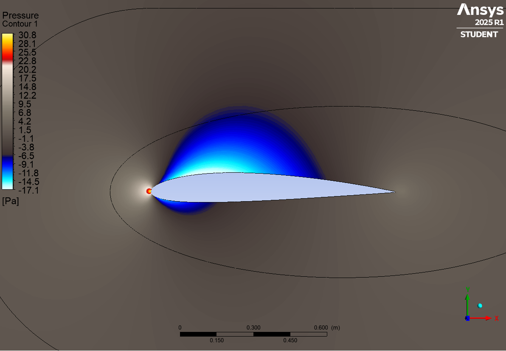

## Overview
This project focuses on the aerodynamic analysis of a **NACA 2412 airfoil** at angles of attack of **0°, 10°, and 15°**.  
The simulations are performed under the following flow conditions:  

- Reynolds number: 5×10^5  
- Reynolds number: 10×10^5
- Reynolds number: 15×10^5  
- Target y+ = 1  

The purpose is to evaluate and compare **lift, drag, and aerodynamic efficiency** under varying operating conditions.  

  
  

## Objectives
- Develop geometries and meshes for airfoils at different angles of attack.  
- Conduct CFD simulations using **Ansys Fluent**.  
- Compare and analyze results across multiple Reynolds numbers.  

## Software & Tools
- **Airfoil Tools**: NACA 4-digit generator (.dat file).  
- **Ansys Workbench**:  
  - *SpaceClaim*: Geometry modeling.  
  - *Meshing*: Grid generation.  
  - *Fluent*: CFD simulation and post-processing.  
