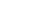
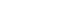
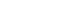
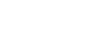

## Geometry and Domain
The geometry of the NACA 2412 airfoil is imported from Airfoil Tools, where a rectangular domain of 20 m × 10 m is created, as shown below.

  

The domain is subdivided into internal, intermediate, and external regions.
## Mesh
###  Y-Plus Wall Distance Estimation
`y+` is a dimensionless parameter that quantifies the distance of the first mesh cell from the wall, normalized by the flow's viscosity and friction velocity.

  

The following steps are used to calculate the wall distance:

- Determine the friction velocity, `u`, as:

  

- Determine the wall shear stress, `tau`, as:  

  

- Approximate the friction coefficient,`Cf`, using the flat-plate correlation for turbulent flow:

  

### Inflation Layers
Inflation layers are a commonly used technique to capture the boundary layer accurately in CFD simulations. 

The following steps are used to calculate the number of inflation layers:

- Determine the boundary layer thickness, `sigma`, as:

  

- Determine number of layers, `N`, as:

  

The simulations are performed under standard sea-level conditions, i.e., `ρ` = 1.225 kg/m^3 and `μ`= 1.789 × 10^-5 Pa·s. The airfoil chord length is 1 m and the growth rate `G` is 1.2

**Table 1. Inflation layer calculations**  
| Reynolds Number | Number of Layers | First Layer Thickness (m) |
|-----------------|------------------|---------------------------|
| 500,000         | 18               | 0.00020844                |
| 1,000,000       | 24               | 0.00005986                |
| 1,500,000       | 27               | 0.00002885                |
